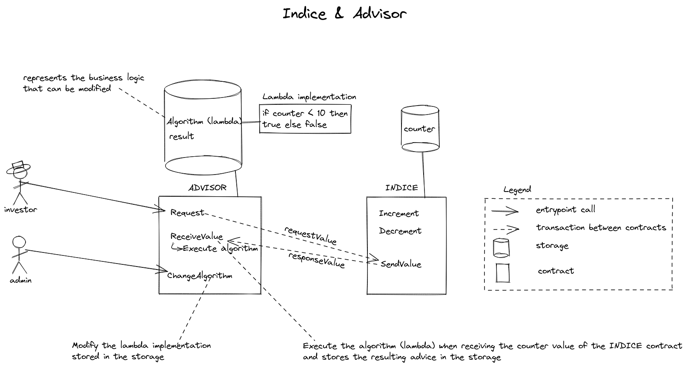

# ligo_tutorial_fundadvisor

This repository is meant to illustrate the communication between contracts (with `get_entrypoint_opt` LIGO function) and lambda pattern which allows to modify a contract already deployed. It deals with implementing, deploying and interacting with Tezos smart contracts.

## The Fund and its advisor (i.e. "L'indice et le conseiller")

The `indice` contract represents a fund value and the `advisor` contract gives an advice on investing on this fund. 

### Transaction workflow

The `advisor` contract can be invoked to request the fund value to the `indice` contract (via a transaction). The `indice` contract receives the request (transaction) and sends back the requested value. When `advisor` contract receives the fund value it can apply the "algorithm" to check it is worth investing ! This algorithm relies on a single indice value.

The resulting advice is stored in the storage (in `result` field).

### Lambda pattern

The real business logic of the `advisor` smart contract lies in the lambda function which is defined in the storage. The storage is vowed to be modified so as for the business logic (lambda).

So an entrypoint `ChangeAlgorithm` is provided to modify the algorithm that computes the worth of investment. 

## Content

The `src` directory contains 3 directories:
- pascaligo: for smart contracts implementation in Pascaligo and `ligo` command lines for simulating all entrypoints
- cameligo: for smart contracts implementation in cameligo and `ligo` command lines for simulating all entrypoints
- jsligo: for smart contracts implementation in JSligo and `ligo` command lines for simulating all entrypoints
